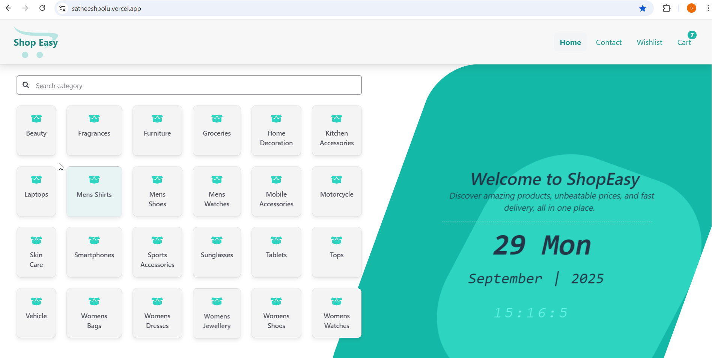
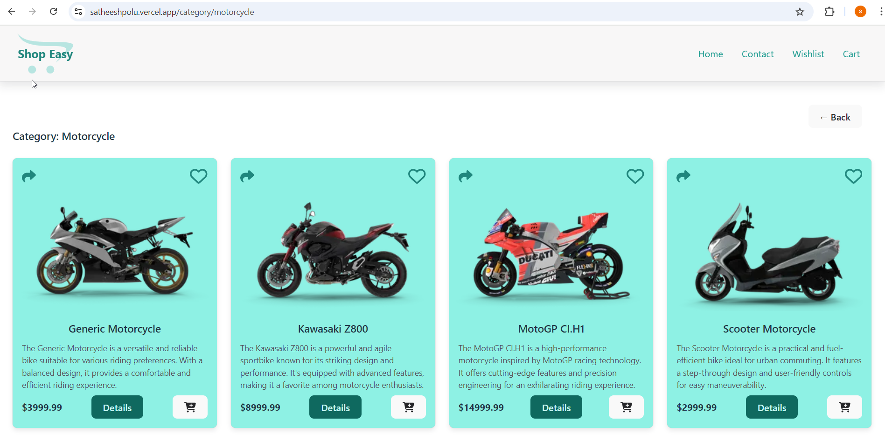
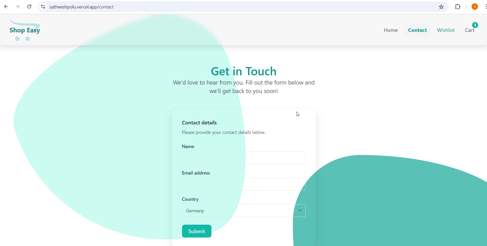
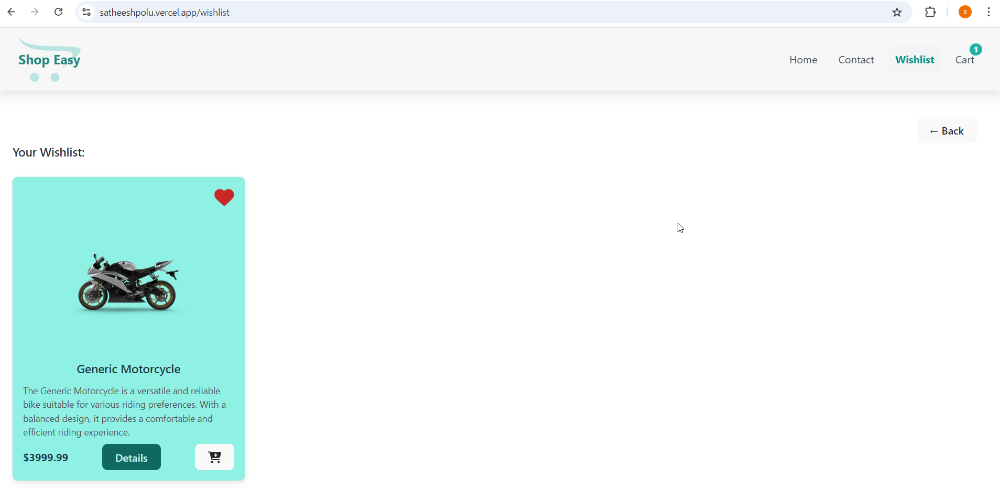
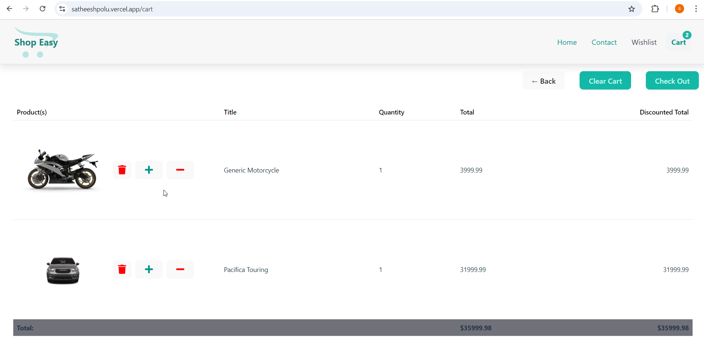

# 🛒 Shop Easy — Fast, Modern E-Commerce App

Shop Easy is a blazing-fast and modern e-commerce web application built with the latest front-end technologies. It delivers a **smooth shopping experience**, **scalable architecture**, and a **clean, modern UI**. Powered by [Vite](https://vitejs.dev/) for lightning-fast builds and deployed seamlessly on [Vercel](https://vercel.com/), Shop Easy ensures effortless performance with zero downtime.

👉 **Live Demo**: [Shop Easy](https://satheeshpolu.vercel.app/)

---

## 🚀 Features
- ⚡️ **High Performance** — Built with Vite for instant reloads and optimized builds.
- 🎨 **Modern UI** — Styled with [Chakra UI](https://chakra-ui.com/) for accessible and responsive design.
- 📦 **State Management** — Powered by [zustand](https://github.com/pmndrs/zustand) and [@tanstack/react-query](https://tanstack.com/query) for efficient data handling.
- 🔗 **REST API Integration** — Product data fetched from [DummyJSON](https://dummyjson.com/products).
- ✅ **Testing Ready** — Robust test coverage with Jest and React Testing Library.

---

## 🛠️ Tech Stack

### Frontend
- [React](https://react.dev/)
- [TypeScript](https://www.typescriptlang.org/)
- [Chakra UI](https://chakra-ui.com/)
- [zustand](https://github.com/pmndrs/zustand)
- [@tanstack/react-query](https://tanstack.com/query)

### Testing
- [Jest](https://jestjs.io/)
- [@testing-library/react](https://testing-library.com/docs/react-testing-library/intro/)

### Build Tool
- [Vite](https://vitejs.dev/)

### API
- [DummyJSON Products API](https://dummyjson.com/products)

---

## 🌐 Deployment
The app is deployed on [Vercel](https://vercel.com/), ensuring:
- ⚡ Instant global edge deployment
- 🔄 Continuous integration with GitHub
- 🕒 Zero downtime updates

---

## 📸 Preview

Take a quick look at **Shop Easy** in action!  
From browsing products to managing your wishlist and cart, the app provides a smooth, modern shopping experience.

- 🏠 **Home Page** — Clean, modern design showcasing products at a glance  
  

- 📂 **Category Details Page** — Browse products by category with ease  
  

- 📞 **Contact Page** — Simple and intuitive way for customers to get in touch  
  

- 💖 **Wishlist Page** — Save favorite products for later with one click  
  

- 🛒 **Cart Page** — Smooth checkout flow with all your selected items  
  


## 📦 Getting Started

### 1. Clone the repo
```
    git clone https://github.com/your-username/shop-easy.git
    cd shop-easy 
``` 

### 2. Install dependencies

```
shop-easy > npm install
```
### 3. Start development server
```
shop-easy > npm run dev
```

### 4. Run tests
```
shop-easy > npm run test
```

### 5. Build the app
```
shop-easy > npm run build
```
